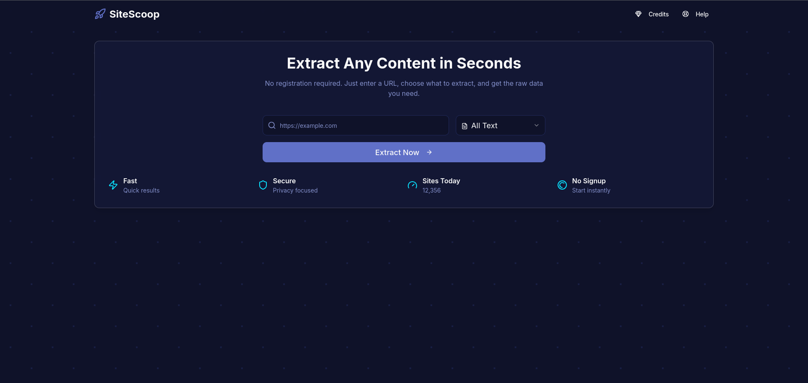

# SiteScoop 🚀

Instantly extract text, links, images, and tables from any website. SiteScoop is a sleek, no-login-required web scraping tool designed for simplicity and power.



---

## About The Project

SiteScoop provides a clean and intuitive interface for quick and easy web scraping. Whether you're a developer, a data analyst, or just someone who needs to quickly grab information from a webpage, SiteScoop streamlines the process. Just enter a URL, choose the content type you need, and get your data in seconds. No accounts, no hassle.

The application also features an optional, premium AI-powered cleaning service to help you format and standardize the extracted data for immediate use.

---

## Core Features

*   **No Signup Required:** Start scraping instantly without any registration.
*   **Versatile Content Extraction:** Scrape different types of content from any URL:
    *   **All Text:** Extract the entire text content from a page.
    *   **All Links:** Gather every hyperlink.
    *   **All Images:** Collect all image URLs.
    *   **All Tables:** Scrape structured data from HTML tables.
*   **Interactive Results Viewer:**
    *   Cleanly presents extracted text, links, and images.
    *   Advanced view for tables with filtering, table selection, and a JSON format toggle.
*   **Flexible Export Options:** Download your extracted data as a raw **CSV** or structured **JSON** file.
*   **AI-Powered Data Cleaning:** A premium feature to automatically clean and format your raw data for better readability and consistency.

---

## Built With

This project is built on a modern, robust tech stack:

*   [Next.js](https://nextjs.org/) - React Framework
*   [React](https://reactjs.org/) - UI Library
*   [Tailwind CSS](https://tailwindcss.com/) - Utility-First CSS Framework
*   [ShadCN/UI](https://ui.shadcn.com/) - Component Library
*   [Genkit for Firebase](https://firebase.google.com/docs/genkit) - AI Integration Toolkit
*   [Cheerio](https://cheerio.js.org/) - Server-side HTML Parsing

---

## Getting Started

To get a local copy up and running, follow these simple steps.

### Prerequisites

Make sure you have Node.js and npm installed on your machine.
*   npm
    ```sh
    npm install npm@latest -g
    ```

### Installation

1.  Install NPM packages
    ```sh
    npm install
    ```
2.  Set up your environment variables. Create a `.env` file in the root of the project and add your Google AI API Key for the Genkit features to work.
    ```env
    GOOGLE_API_KEY='YOUR_API_KEY'
    ```
3.  Run the development server
    ```sh
    npm run dev
    ```
    Open [http://localhost:3000](http://localhost:3000) with your browser to see the result.

---
## How It Works

1.  **Enter URL:** Paste the URL of the website you want to scrape into the input field.
2.  **Select Content Type:** Choose whether you want to extract `Text`, `Links`, `Images`, or `Tables` from the dropdown menu.
3.  **Extract:** Click the "Extract Now" button.
4.  **View & Refine:** Your scraped data will appear in the results view. For tables, you can filter which ones to display and toggle between table and JSON views.
5.  **Export or Clean:**
    *   Download the raw data as a CSV or JSON file.
    *   (Optional) Use the premium "Clean with AI" feature to automatically process and format your data.

---
